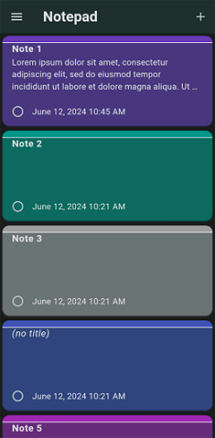
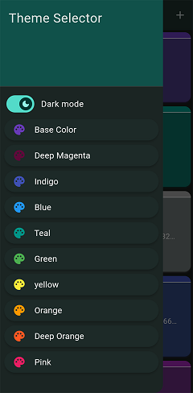
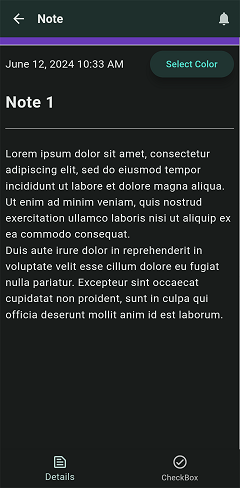
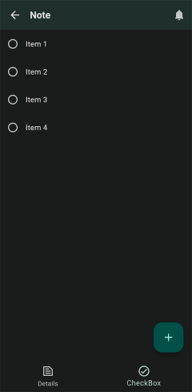

# Welcome to Mohamed Hamdy Projects Display 
	email: mohammed.hamdy02@gmail.com

### Summary
Mechatronics Engineer Graduate with excellence, studied at Higher Technological Institute (HTI)

#### I have experience by doing some projects using these:

 - Desktop Application using Qt Framework (C++):
	+ Delta Robot pick & place with object detection (Graduation project).
	+ Internet_10 (just to get the hang of Qt Framework).
 - 3D design using SolidWorks:
	+ Delta Robot (Graduation project).
	+ 3D prototyping at some subjects that I have taken.
 - Arduino Programming:
	+ Delta Robot (Graduation project).
	+ RC Car obstacle avoidance using ultrasonic proximity sensors.
	+ RC Car line follower for pick and transport.
	+ RC Car remote controlled (incomplete).
 - PCB Design (Autodesk Eagle):
	+ Workbench power supply.
	+ L298N based DC motor driver.
 - Flutter (all personal projects):
	+ Internet usage calculator (Internet_9).
	+ New Notes App (EQM Notes).
	+ Old Notes App (Notepad Markdown).
	+ Timer Application (All Jobs Timer).
	+ Remote control for RC Car (incomplete).
	

## 1. Delta Robot Control Panel Desktop App
The application was developed to help with the control of the delta robot 
from any desktop PC/Laptop to facilitate the development and control of the
project.

### why did we choose Qt
we chose Qt framework because it has a very good-looking UI and links the 
UI Elements with the backbone code that runs the application from handling 
the serial communication to doing the image processing of detecting objects
(using OpenCV) available to be picked up.

### Application UI

### Video Display

## 2. RC Car Pick & Place
This is a line follower RC Car that picks up objects from one place and 
transport them to the next place using an arm bolted on top of the car

### Video Display

## 3. New Notes App (EQM Notes)
This is a notes application build with flutter targeted for android devices
it can take notes as text and for each note you can add a list of checkbox items
in the checkboxes screen and it also can schedule a notification at a future time.
### Application UI

|  | |
|:-------------------------------------------------------:|:--------------------------------------------------------:|
|                       Home Screen                       |                       Theme Screen                       |
|  | |
|                       Note Screen                       |                       Checkbox Screen                    |
